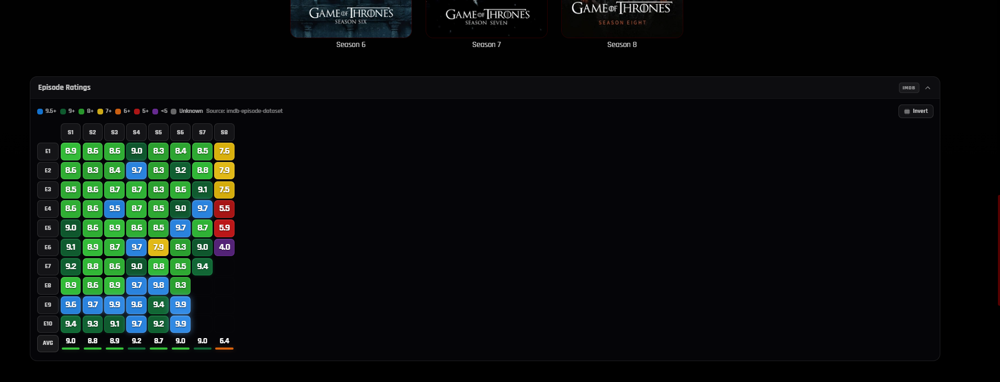

# Jellyfin IMDb Episode Ratings Grid

A custom JavaScript injection for Jellyfin that adds a colour-coded episode ratings grid to any TV series detail page, pulling data directly from IMDb via the [ya0903/imdb-episode-dataset](https://github.com/ya0903/imdb-episode-dataset) hosted on jsDelivr's CDN.



## Features

- Colour-coded rating cells across a full season × episode grid
- Season average scores with a coloured indicator bar
- Invertible layout — swap between episodes-as-rows and episodes-as-columns
- Hover tooltips showing episode code, title, and IMDb rating
- Handles combined/double episodes with a `2+` badge
- Marks unreleased episodes without a rating
- Clicking a rated cell navigates to the episode in Jellyfin; unmatched episodes link out to the IMDb season page
- Shimmer loading skeleton while data fetches
- Session-cached responses (6 hours for ratings, 30 minutes for episode metadata) to avoid redundant requests
- No API key required — zero external dependencies beyond the CDN dataset

## Colour Scale

| Colour | Rating |
|--------|--------|
| 🔵 Blue | 9.5+ |
| 🟢 Dark Green | 9.0–9.4 |
| 🟢 Green | 8.0–8.9 |
| 🟡 Yellow | 7.0–7.9 |
| 🟠 Orange | 6.0–6.9 |
| 🔴 Red | 5.0–5.9 |
| 🟣 Purple | Below 5.0 |
| ⚪ Grey | No rating / unreleased |


## Requirements

- A running Jellyfin instance (tested on Jellyfin 10.11.6)
- The series must have an IMDb ID set in its metadata — Jellyfin fetches this automatically via its standard metadata providers
- A way to inject custom JavaScript into the Jellyfin web client (see Installation below)

## Installation

### Option A — Jellyfin Custom JavaScript field via CDN (recommended)

[Javascript Plugin](https://github.com/n00bcodr/Jellyfin-JavaScript-Injector) must be installed

The easiest install. Instead of copying the whole script, paste a single loader line into Jellyfin's custom JS field. The script is served directly from this repo via jsDelivr, so you'll automatically receive updates whenever the repo is updated (subject to jsDelivr's CDN cache, which clears within ~24 hours).

1. In Jellyfin, go to **Dashboard → General**
2. Scroll down to **Custom JavaScript**
3. Paste one of the following:

**Using dynamic import (cleanest):**
```js
import("https://cdn.jsdelivr.net/gh/ya0903/jellyfin-episode-grid@main/jellyfin-episode-grid.js");
```

**Using script tag injection (more compatible):**
```js
const s = document.createElement("script");
s.src = "https://cdn.jsdelivr.net/gh/ya0903/jellyfin-episode-grid@main/jellyfin-episode-grid.js";
document.head.appendChild(s);
```

4. Click **Save** and hard-refresh your browser (`Ctrl+Shift+R`)

### Option B — Jellyfin Custom JavaScript field (manual, pinned)

If you'd rather self-host the script or pin to a specific version without relying on the CDN:

1. In Jellyfin, go to **Dashboard → General**
2. Scroll down to **Custom JavaScript**
3. Paste the entire contents of `jellyfin-episode-grid.js` into the field
4. Click **Save** and hard-refresh your browser (`Ctrl+Shift+R`)

### Option C — Tampermonkey / Violentmonkey

1. Install [Tampermonkey](https://www.tampermonkey.net/) or [Violentmonkey](https://violentmonkey.github.io/) in your browser
2. Create a new userscript
3. Replace the default template content with the following header, then paste the script body beneath it:

```js
// ==UserScript==
// @name         Jellyfin IMDb Episode Ratings Grid
// @namespace    jellyfin-imdb-ratings
// @version      1.0
// @match        http://YOUR_JELLYFIN_URL/*
// @match        https://YOUR_JELLYFIN_URL/*
// @grant        none
// ==/UserScript==
```

Replace `YOUR_JELLYFIN_URL` with your actual Jellyfin address (e.g. `jellyfin.example.com`).

### Option D — Direct file injection

If you have filesystem access to your Jellyfin web client:

1. Locate the Jellyfin web root (typically `/usr/share/jellyfin/web/` on Linux)
2. Copy `jellyfin-episode-grid.js` there
3. Edit `index.html` and add before `</body>`:

```html
<script src="jellyfin-episode-grid.js"></script>
```

## How It Works

1. When you navigate to a TV series detail page, the script detects the Jellyfin item ID from the URL
2. It queries the Jellyfin API to confirm the item is a Series and retrieve its IMDb ID
3. It fetches the corresponding JSON file from the [ya0903/imdb-episode-dataset](https://github.com/ya0903/imdb-episode-dataset) via jsDelivr CDN — no API key needed
4. Episode metadata (names, air dates, combined episode flags) is fetched from your local Jellyfin library
5. The two data sources are merged and rendered as a grid, inserted above the cast section
6. If the show isn't in the dataset, the grid falls back to a link to the IMDb ratings page


## Data Source

Episode ratings come from [ya0903/imdb-episode-dataset](https://github.com/ya0903/imdb-episode-dataset), an open dataset of IMDb episode ratings served via jsDelivr's global CDN. The dataset is updated periodically. If a show is missing or ratings are stale, check that repository for coverage details.

## Privacy & Security

- The script reads your Jellyfin access token from `localStorage` solely to query your own Jellyfin instance — it is never sent anywhere else
- The only external request made is to `cdn.jsdelivr.net` to fetch the ratings dataset
- No telemetry, no tracking, no external accounts required

## Limitations

- Coverage depends on the upstream dataset — obscure or very recently aired shows may not be included
- Per-episode IMDb page links are not available (the dataset does not include individual episode IDs); clicking an episode links to its IMDb season page instead
- Ratings reflect the dataset's last update, not live IMDb data

## License

MIT — do whatever you like with it. Credit appreciated but not required.

Dataset credit: [ya0903/imdb-episode-dataset](https://github.com/ya0903/imdb-episode-dataset)
